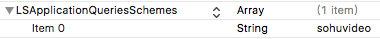

# iOS 搜狐视频公共平台通用SDK

---------

### 引入方式

```
pod 'TeaMediaPlayer'
pod install
```


### OpenSDK 组成部分
* SohuVideoFoundation.framework : 搜狐播放器器功能库
* TeaMediaPlayerFrameWork.framework : 依赖库 

### 添加搜狐的scheme


### 添加定位描述


---------

# 开始使⽤用SDK

### 一、注册apikey及partner

```
// AppDelegate.m

	// 方式一、
	// [[SVFApplication sharedApplication] registerWithConfigName:@"SohuPlayerConfig.plist"];
    
    // 方式二、
    [[SVFApplication sharedApplication] registerApiKey:@"621d7cd50fbf2d125b5c153d45fa33bc" partner:@"130066"];
```

### 二、播放视频

调⽤下⾯方法创建播放器器视图:

```
UIView <SVFVideoPlayerProtocols>* playerView = [SVFApplication createVideoPlayer];

// 播放视频，来源搜狐视频
[playerView resumeVid:@"3357323" site:@"1"];

// 播放视频，任意url视频源
[playerView resumeURL:self.url];

```

### 三、播放器协议"SVFVideoPlayerProtocols.h"

```
 .....
 
/**
 播放搜狐视频的源
 
 @param vid 搜狐视频的vid
 @param site 视频来源
 @param startPos 播放起始点。秒/单位
 */
- (void)resumeVid:(NSString *)vid site:(NSString *)site startPos:(NSInteger)startPos;
- (void)resumeVid:(NSString *)vid site:(NSString *)site;


/**
 播放非搜狐视频的源

 @param url 视频地址
 */
- (void)resumeURL:(NSString *)url;

///更多API请查看头⽂文件 ....

```

---------

### 四、下载功能

主要通过 SVFDownloadManager 与 SDK交互;

```
///添加任务
- (void)addTaskWithVideoInfo:(SVFDownloadVideoInfo *)videoInfo competion:(void(^)( NSError * err))completion;
///开始所有任务
[[SVFDownloadManager sharedManager]startAllDownloadTasks];
///暂停所有任务
[[SVFDownloadManager sharedManager]pauseAllDownloadTasks];
///删除指定任务
- (void)removeDownloadTask:(SVFDownloadTask *)task;
///更多API请查看头⽂文件 ....
```

---------


### Version:
* v6.5    2017.11.29 release
	* 制作pod库
* v6.5.1  2018.05.25 release 
	* 更新内容 
	* 1.优化第一帧播放速度。
	* 2.增加api及partner注册方式。

-----

### Demo

在AppDelegate中传入的配置文件中填入 apikey 和 partner 后即可运⾏!